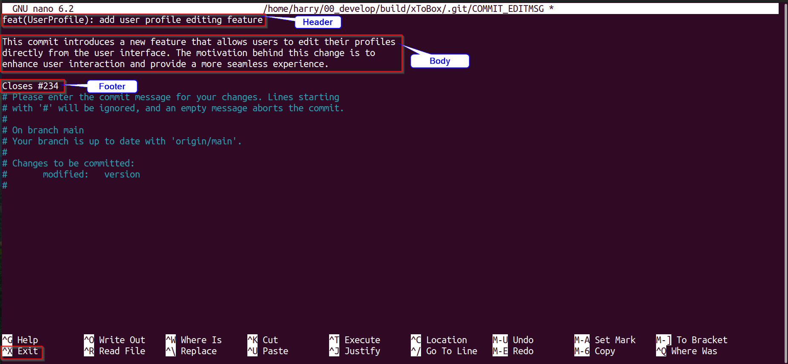
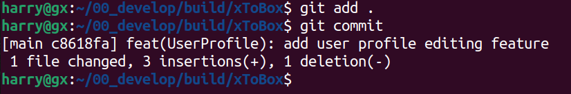

# git commit 规范：commit message 写作指北


------


### 1  说明

​		本文主要介绍使用 git commit 提交代码时如何书写 message，及 message 对应规范，需严格遵循 message 规范。很多人在提交git信息的时候，为了图方便，大多都会简单的写一下，开发一时爽，维护火葬场。清晰且统一的提交风格，有利于团队的协作和后期的维护。


### 2  必要性

​		在开发过程中，git每次提交代码，都需要写commit message（提交说明），例如：

```shell
git commit -m "Your commit message"
```


一般来说，commit message 应该清晰明了，说明本次提交的目的，规范的commit message有很多好处：

- 方便快速浏览查找，回溯之前的工作内容
- 可以过滤某些commit（比如文档改动），便于快速查找信息
- 可以直接从commit生成change log


### 3  规范

​		经过实际调查，目前普遍使用最多的commit message 规范如下格式：（包括三部分：Header、Body和Footer，Header是必需的，Body和Footer则可以省略）

```shell
<type>(<scope>): <subject>
<!-- 空行 -->
<body>
<!-- 空行 -->
<footer>
```


#### 3.1   规范说明

| 字段       | 必须         | 说明                                                         |
| ---------- | ------------ | ------------------------------------------------------------ |
| *<type>    | 是           | 提交类别                                                     |
| <scope>    | 否           | 用于说明 commit 影响的范围，建议填写影响的功能模块           |
| *<subject> | 是           | commit 目的的简短描述，不超过50个字符                        |
| <body>     | 否(建议填写) | 描述当前修改的行为详细信息或修改的目的                       |
| <footer>   | 否           | 一般用于描述BREAKING CHANGE，在项目开发中一般不需要填写，组件研发的工程需要填写 |


#### 3.2   字段说明

##### 3.2.1    *<type>提交类别

​		**必填**，<type> 在 commit 的 message 中是必须存在的。<type>可以有以下标识：

| 序号 | 标识     | 说明                                                         |
| ---- | -------- | ------------------------------------------------------------ |
| 1    | feat     | 用于表示引入新功能或特性的变动。这种变动通常是在代码库中新增的功能，而不仅仅是修复错误或进行代码重构。 |
| 2    | fix/to   | 修复bug。这些bug可能由QA团队发现，或由开发人员在开发过程中识别。 |
|      | fix      | `fix`关键字用于那些直接解决问题的提交。当创建一个包含必要更改的提交，并且这些更改能够直接修复已识别的bug时，应使用`fix`。这表明提交的代码引入了解决方案，并且问题已被立即解决。 |
|      | to       | `to`关键字则用于那些部分处理问题的提交。在一些复杂的修复过程中，可能需要多个步骤或多次提交来完全解决问题。在这种情况下，初始和中间的提交应使用`to`标记，表示它们为最终解决方案做出了贡献，但并未完全解决问题。最终解决问题的提交应使用`fix`标记，以表明问题已被彻底修复。 |
| 3    | docs     | 表示对文档的变动，这包括对代码库中的注释、README 文件或其他文档的修改。这个前缀的提交通常用于更新文档以反映代码的变更，或者提供更好的代码理解和使用说明。 |
| 4    | style    | 用于表示对代码格式的变动，这些变动不影响代码的运行。通常包括空格、缩进、换行等风格调整。 |
| 5    | refactor | 表示对代码的重构，即修改代码的结构和实现方式，但不影响其外部行为。重构的目的是改进代码的可读性、可维护性和性能，而不是引入新功能或修复错误。 |
| 6    | perf     | 表示与性能优化相关的变动。这可能包括对算法、数据结构或代码实现的修改，以提高代码的执行效率和用户体验。 |
| 7    | test     | 表示增加测试，包括单元测试、集成测试或其他类型的测试。       |
| 8    | chore    | 表示对构建过程或辅助工具的变动。这可能包括更新构建脚本、配置文件或其他与构建和工具相关的内容。 |
| 9    | revert   | 用于回滚到以前的版本，撤销之前的提交。                       |
| 10   | merge    | 表示进行代码合并，通常是在分支开发完成后将代码合并回主线。   |
| 11   | sync     | 表示同步主线或分支的 Bug，通常用于解决因为合并而引入的问题。 |


##### 3.2.2    <scope> 影响范围

​		非必填（建议填写），<scope> 用于说明 commit 影响的范围，建议填写影响的功能模块。如果修改影响不止一个 scope，可以使用 * 代替。


##### 3.2.3    *<subject> 简短描述

​		**必填**，commit 目的的简短描述，不超过50个字符。规范如下：

- 以动词开头，使用第一人称现在时，比如 `change`，而不是`changed`或`changes`
- 第一个字母小写
- 结尾不加句号

例如：

```shell
fix (driver): sending ARP packets causes network port crashes
```

这个提交消息中，`sending ARP packets causes network port crashes` 是 `subject`，清晰地说明了修复发送ARP包导致网口崩溃的目的。


##### 3.2.4    <body> 详细信息

​		非必填（建议填写），可描述当前修改的行为详细信息或修改的目的，可以分成多行。Body编写有两个注意点：

- 使用第一人称现在时，比如使用`change`而不是`changed`或`changes`。这有助于使描述更加直观和连贯，增强可读性。
- 应该说明代码变动的动机，以及与以前行为的对比。 `Body` 部分不仅仅是描述代码的变动，还应该解释为什么进行这个变动，以及与之前的代码行为相比有哪些改进。这有助于其他开发者更好地理解代码变更的背后动机和意图。


##### 3.2.5    <footer> 尾部注释

​		非必填，一般Footer 部分只用于两种情况，在项目开发中一般不需要填写，组件研发的工程需要填写。

- 不兼容变动

如果当前代码与上一个版本不兼容，则 Footer 部分以`BREAKING CHANGE`开头，后面是对变动的描述、以及变动理由和迁移方法。

- 关闭 Issue

如果当前 commit 针对某个issue，那么可以在 Footer 部分关闭这个 issue 。

```shell
Closes #234
```

也可以一次关闭多个 issue 。

```shell
Closes #123, #245, #992
```


#### 3.3   示例

- 添加用户配置文件编辑功能

```shell
feat(UserProfile): add user profile editing feature

This commit introduces a new feature that allows users to edit their profiles
directly from the user interface. The motivation behind this change is to
enhance user interaction and provide a more seamless experience.

Previously, users had to navigate to a separate editing page to update their
profile information. With this new feature, users can now make changes
efficiently from their profile page, eliminating unnecessary steps in the
workflow.

Changes included in this commit:
- Added a new 'Edit Profile' button on the user profile page.
- Implemented frontend components for profile editing.
- Updated backend API to handle profile updates securely.

By streamlining the profile editing process, we aim to improve overall user
satisfaction and make our application more user-friendly. This enhancement is
in response to user feedback, addressing the need for a more intuitive and
accessible way to modify profile details.

Closes #234
```

- 纠正输入验证逻辑

```shell
fix(Validation): correct input validation logic

This commit addresses an issue related to input validation logic in the
application. Previously, the validation process was not handling certain edge
cases correctly, leading to unexpected behavior in specific scenarios.

To resolve this issue, the validation logic has been revised to properly
handle various input scenarios. This ensures that user input is thoroughly
validated, reducing the likelihood of errors in the application.

The changes made in this commit include:
- Correcting boundary checks for user input.
- Improving error messages for better user guidance.

These adjustments align with our commitment to delivering a robust and
reliable application experience.

Closes #123
```


### 4  提交方式

#### 4.1   手动提交（不推荐）

​		前提：（配置个人信息）

```shell
git config --global user.email "harry-gx@outlook.com"
git config --global user.name "harry"
```

​		当执行完`git add .` 后，直接执行`git commit ` ，不带`-m ` 参数。会进入message编辑的临时缓冲区界面



填写完成后，按CTRL+X退出，会弹出保存提示框，选Y即可保存退出。



至此手动提交完成！


#### 4.2   工具提交（推荐）

​		Commitizen是一个强大的工具，用于撰写合格的 Git 提交消息。使用 Commitizen 可以帮助团队遵循统一的提交消息规范，使提交历史更加清晰和易读。


- ##### 依赖


使用下面命令查看nodejs版本：

```shell
node -v
```

如果你的本地环境的nodejs版本低于12，需要更新版本

```shell
wget https://nodejs.org/dist/v14.17.0/node-v14.17.0-linux-x64.tar.xz

sudo apt-get install xz-utils

sudo tar -C /usr/local --strip-components 1 -xJf node-v14.17.0-linux-x64.tar.xz

which node

sudo ln -sf /usr/local/bin/node /usr/bin/node
```


- ##### 安装commitizen

首先，通过以下命令全局安装 Commitizen：

```shell
sudo npm install -g commitizen
```

*注：*执行上述命令前需要先确保安装了npm，如果没有执行`sudo apt install npm ` 


- ##### 安装adapter

  - [x] **cz-conventional-changelog**

  ​		commitizen根据不同的`adapter`配置commit message。例如，要使用Angular的commit message格式，可以安装`cz-conventional-changelog`。

  ```shell
  sudo npm install -g cz-conventional-changelog
  
  echo '{ "path": "cz-conventional-changelog" }' > ~/.czrc
  ```

  现在，进入任何git repository, 使用git cz代替git commit提交commit。

  

  - [x] **cz-customizable**

​				cz-customizable和cz-conventional-changelog一样，也是commitizen的adapter，不过支持一定程度上的自定义。

```shell
sudo npm install -g cz-customizable  或者  sudo npm i cz-customizable --save-dev

echo '{ "path": "cz-customizable" }' > ~/.czrc
```

*注：*使用**sudo npm i cz-customizable --save-dev**这个命令带有**--save-dev**参数会自动在当前目录下生成**node_modules**文件夹


- [x] 自定义配置

​		在home目录下创建 **.cz-config.js** 文件,根据`node_modules/cz-customizable/cz-config-EXAMPLE.js`配置git cz时弹出的message和对应的输入或者选项。

*注：*自定义配置可以根据node_modules/cz-customizable/cz-config-EXAMPLE.js文件中的内容改，配置好的规范格式保存在**.cz-config.js** 文件中即可


或者添加如下配置：（示例）

```js
module.exports = {
  // 可选类型
  types:[
    { value: 'feat',     name: 'feat:      新功能'},
    { value: 'fix',      name: 'fix:       修复'},
    { value: 'docs',     name: 'docs:      文档变更'},
    { value: 'style',    name: 'style:     代码格式（不影响代码运行的变动）'},
    { value: 'refactor', name: 'refactor:  重构（既不是增加feature）,也不是修复bug'},
    { value: 'pref',     name: 'pref:      性能优化'},
    { value: 'test',     name: 'test:      增加测试'},
    { value: 'chore',    name: 'chore:     构建过程或辅助工具的变动'},
    { value: 'revert',   name: 'revert:    回退'},
    { value: 'build',    name: 'build:     打包'}
  ],

  // 步骤
  messages: {
    type: '请选择提交的类型；',
    customScope: '请输入修改的范围（可选）',
    subject: '请简要描述提交（必填）',
    body: '请输入详细描述（可选）',
    footer: '请选择要关闭的issue（可选）',
    confirmCommit: '确认要使用以上信息提交？（y/n）'
  },

  // 跳过步骤
  skip: ['body', 'footer'],

  // 默认长度
  subjectLimit: 72
}

```

